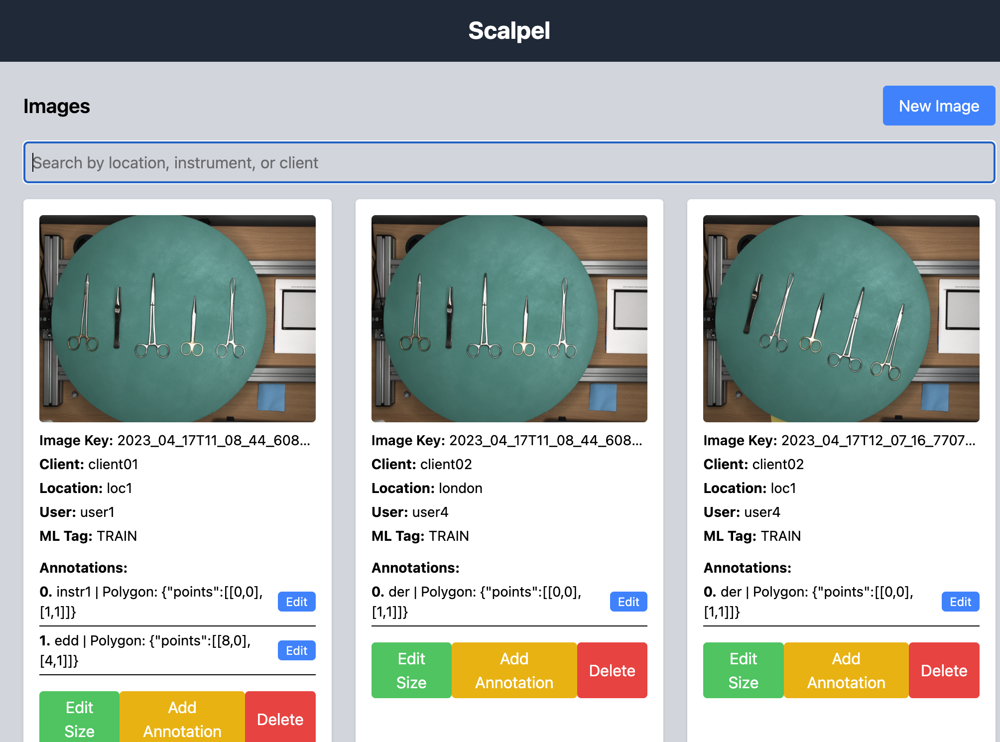
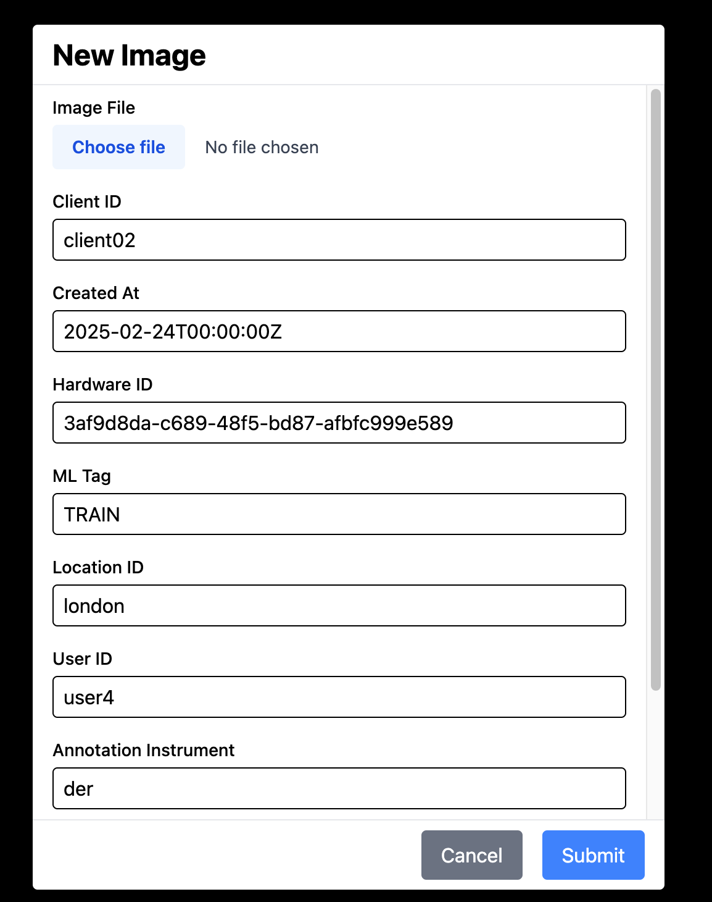
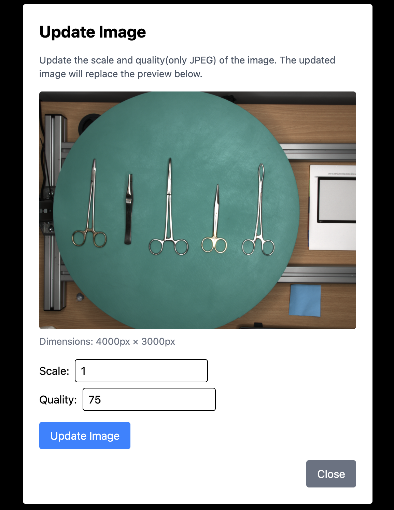
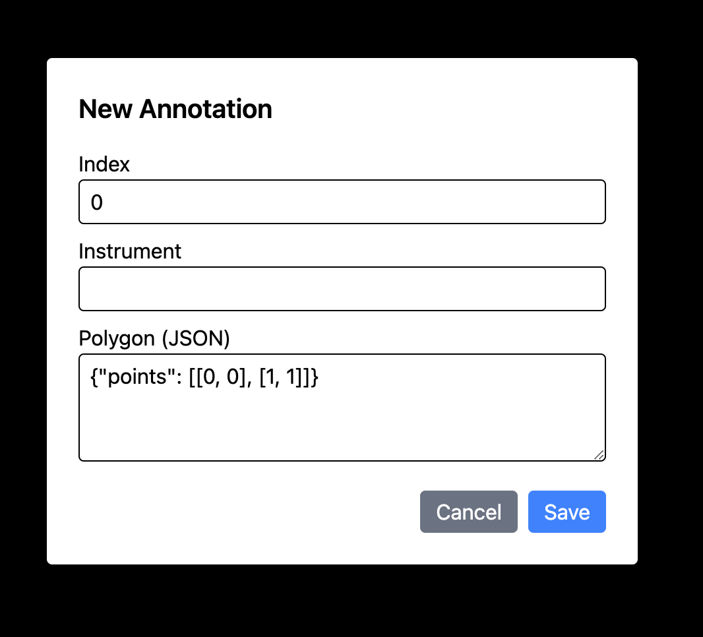
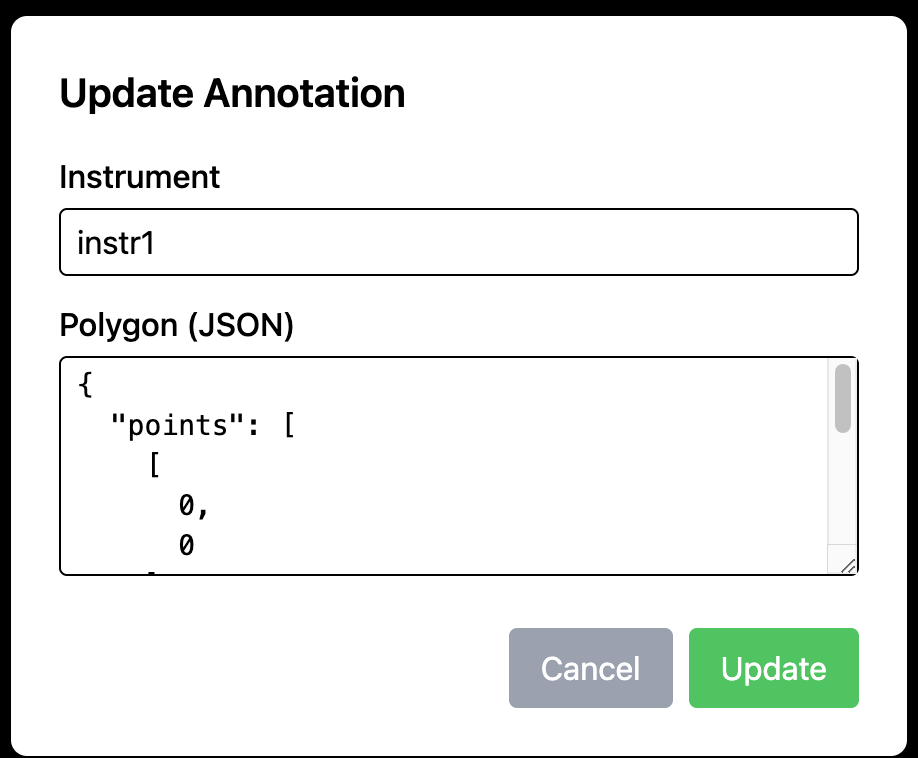

# Scalpel Backend Challenge with FastAPI & Async SQLAlchemy

This project is a backend service for a Data Capture Application. It provides asynchronous API endpoints for managing images and their annotations using FastAPI, SQLAlchemy (with async support), and PostgreSQL.

## Features

- **Asynchronous API Endpoints**: Built with FastAPI and async SQLAlchemy.
- **ORM Models**: Defines models for Images, Annotations, Users, and Locations.
- **CRUD Operations**: Create images and annotations, update annotations, list images with filters, retrieve images/annotations and return an image (with optional scale and quality adjustments).
- **Dependency Management**: Uses virtual environments.

## Project Structure
```
project-root/
|--
├── Dockerfile
├── README.md
├── docker-compose.yml
├── frontend
│   ├── README.md
│   ├── src
│   │   ├── App.tsx
│   │   ├── Appnew.tsx
│   │   ├── components
│   │   ├── index.css
│   │   ├── main.tsx
│   │   ├── types.ts
├── src
│   ├── app
│   │   ├── database.py
│   │   ├── images
│   │   ├── main.py
│   │   ├── models.py
│   │   ├── schemas.py
│   ├── requirements.txt
├── tests
│   ├── conftest.py
│   └── test_endpoints.py
└── wait-for-it.sh
             # Project documentation (this file)
```

## Prerequisites

- **Python 3.9+**
- **PostgreSQL**
- **Docker**
- **Node**

## Setup

**Clone the Repository**

   ```bash
   git clone https://github.com/amigo2/scalpel
   cd scalpel
   ```
## Build and run Docker
  Install Docker.  
  For local development I've created a --reload Fastapi app so you can tweak the code and see the changes inmediatly.  

  Build docker app and database, and will run the tests
  ```bash
  docker-compose up --build
  ```
  After building, you can run tests separately.  
  Test backend endpoints async to db
  ```bash
  docker-compose run test  
  ```

The server will start at http://127.0.0.1:8000. You can access the interactive API docs at:

Swagger UI: http://127.0.0.1:8000/docs
ReDoc: http://127.0.0.1:8000/redoc
On startup, the application will automatically create (or update) the necessary database tables.

## Frontend
Using Create React App:  
```bash
npx create-react-app frontend --template typescript
```
When installing vite:  
Target directory "frontend" is not empty.  
Please choose how to proceed:  
│  Remove existing files and continue  

```bash
npm init vite@latest frontend -- --template react-ts
```

install Tailwind for vite
```bash
npm install tailwindcss @tailwindcss/vite
```
Now run
```bash
  cd frontend
  npm install
  npm run dev
  ```
Server will start at http://localhost:5173/


## API Endpoints Overview

- **Create an Image**
  - **Method:** `POST`
  - **Endpoint:** `/images`
  - **Description:** Create an image record with optional annotations.

- **List Images**
  - **Method:** `GET`
  - **Endpoint:** `/images`
  - **Description:** Retrieve a list of images, with optional filtering by user, location, or instrument.

- **Add an Annotation**
  - **Method:** `POST`
  - **Endpoint:** `/images/{image_key}/annotations`
  - **Description:** Add a new annotation for an existing image.

- **List Image Annotations (Not implemented)** 
  - **Method:** `GET`
  - **Endpoint:** `/images/{image_key}/annotations`
  - **Description:** Retrieve all annotations associated with an image.

- **Update an Annotation**
  - **Method:** `PUT`
  - **Endpoint:** `/images/{image_key}/annotations/{annotation_index}`
  - **Description:** Update an existing annotation for an image.
  
- **Retrieve an Image File**
  - **Method:** `GET`
  - **Endpoint:** `/images/{image_key}/file`
  - **Description:** Return an image file (with optional scale and quality adjustments).

## Testing
Use Pytest from root.
```bash
pytest tests/test_endpoints.py --disable-warnings -s
```
or 
```bash
pytest tests/test_endpoints.py
```
Only create Image test developed I'm afraid.  

## Frontend ##

**Some screen shots**  

  

**New Image**  
  

**Update size**  
  

**New annotation**  


**Update annotation**  


## Features ## 
- Users can filter images by annotation, user, client, or location.
- Users can upload and create images with metadata.
- Users can edit image size and quality (JPEG format only).
- Users can add new annotations to images.
- Users can modify existing annotations.
- Users can delete an image by its key.
- Hovering over the image key name displays the full path.  

Note:
Images are stored following a structure similar to Amazon S3, where the file path and file key (filename) are stored separately.


## Interview Review Note

This project is submitted as part of a technical test and is intended for review in the next interview. It is provided "as is" and demonstrates my approach to solving the challenge. I welcome any feedback or discussion during the interview.


